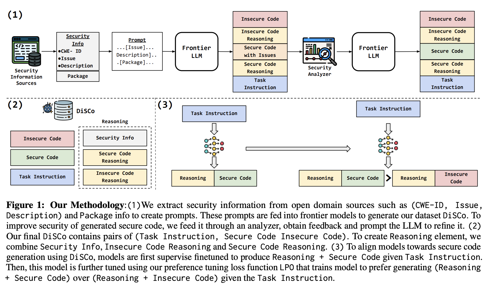

# Teaching an Old LLM Secure Coding: Localized Preference Optimization on Distilled Preferences

This is the Github Repository for the paper "Teaching an Old LLM Secure Coding: Localized Preference Optimization on Distilled Preferences" [(Link)](https://arxiv.org/abs/2506.00419) that has been accepted to **ACL 2025**.

## Abstract

LLM generated code often contains security issues. We address two key challenges in improving secure code generation. First, obtaining high quality training data covering a broad set of security issues is critical. To address this, we introduce a method for distilling a preference dataset of insecure and secure code pairs from frontier LLMs, along with a security reasoning that explains the issues and the fix. The key idea here is to make use of security knowledge sources to devise a systematic prompting strategy that ensures broad coverage. Second, aligning models to secure code requires focusing on localized regions of code. Direct preference optimization methods, like SimPO, are not designed to handle these localized differences and turn out to be ineffective. We address this with a new localized preference optimization algorithm that masks the security related tokens in both the winning (secure) and losing (insecure) responses. To prevent loss in code quality, we also add a regularizer. Evaluations show that both training on our dataset, DiSCo, and the new preference optimization algorithm, LPO, yield substantial reductions in code insecurity while also improving overall code quality. 



## 📋 Table of Contents

- [Overview](#overview)
- [Dataset Pipeline](#dataset-pipeline)
- [Installation](#installation)
- [Data](#data)
- [Models](#models)
- [Training](#training)
- [Evaluation](#evaluation)
- [Generating Your Own Data](#generating-your-own-data)
- [Usage](#usage)
- [File Structure](#file-structure)
- [Configuration](#configuration)
- [Requirements](#requirements)
- [Citation](#citation)
- [Contributing](#contributing)

## 🎯 Overview

The DiSCo-LPO (Distilling Secure Code - Localized Preference Optimization) project generates synthetic datasets containing:

- **Vulnerable Python code** with implicit security issues
- **Corresponding secure versions** with minimal fixes
- **Reasoning explanations** for why code is vulnerable/secure
- **Task instructions** that can guide LLM generation

This synthetic data is created using a multi-stage pipeline that leverages:
- Security rule databases (Bandit, CodeQL, CWE)
- OpenAI GPT-4o for code generation
- Static analysis tools for validation and refinement

## 🔄 Dataset Pipeline

The dataset creation follows a 5-stage pipeline:

```
1. Prompt Creation → 2. Synthetic Generation → 3. Static Analysis → 4. Refinement → 5. Post-processing
```

### Stage 1: Prompt Creation (`prompt_creation.py`)
- Extracts security rules from Bandit, CodeQL, and CWE databases
- Creates two types of prompts:
  - **Simple prompts**: Basic vulnerability-fix pairs
  - **Complex prompts**: Enhanced with random Python modules for diversity

### Stage 2: Synthetic Code Generation (`synthetic_data_creation.py`)
- Uses OpenAI GPT-4 to generate code pairs from prompts
- Creates structured outputs with vulnerable/secure code and reasoning
- Includes rate limiting and error handling for robust generation

### Stage 3: Static Analysis (`refinement_processing.ipynb`)
- Runs Bandit and CodeQL analysis on generated secure code
- Identifies remaining security issues in supposedly "secure" code
- Prepares feedback for the refinement stage

### Stage 4: Code Refinement (`synthetic_data_refinement.py`)
- Takes secure code with identified issues
- Uses GPT-4 to generate more secure versions based on static analysis feedback
- Creates additional reasoning for the improvements

### Stage 5: Dataset Processing (`data_processing.ipynb`)
- Parses and cleanses all generated outputs
- Combines simple and complex datasets
- Splits data into train/validation/test sets
- Handles duplicates and filtering

## Installation

**Python Version**: 3.10.14

1. **Clone the repository:**
   ```bash
   git clone https://github.com/yourusername/disco-lpo.git
   cd disco-lpo
   ```

2. **Install Python dependencies:**
   ```bash
   pip install -r requirements.txt
   # Additional packages for dataset creation:
   pip install pandas numpy openai backoff scikit-learn jupyter
   ```

3. **Install static analysis tools:**
   ```bash
   # Install Bandit
   pip install bandit
   
   # Install CodeQL (follow official installation guide)
   # https://codeql.github.com/docs/codeql-cli/getting-started-with-the-codeql-cli/
   ```

4. **Set up OpenAI API credentials:**
   ```bash
   # Create API key file (replace with actual path)
   echo "your-api-key" > /path/to/openai_keys.txt
   echo "your-org-id" >> /path/to/openai_keys.txt
   ```

## Data

Evaluation datasets are available in the ./eval folder.
DiSCo generated datasets are available in Huggingface at the following link: 
https://huggingface.co/datasets/StonyBrookNLP/DiSCo

### Dataset Output Format

The final datasets contain the following columns:

| Column | Description |
|--------|-------------|
| `Vulnerable Code` | Python code containing security vulnerabilities |
| `Secure Code` | Fixed version of the vulnerable code |
| `More Secure Code` | Further refined secure code (if applicable) |
| `Vulnerable Code Reasoning` | Explanation of why the code is vulnerable |
| `Secure Code Reasoning` | Explanation of the security fixes |
| `Instruction` | Task instruction for LLM training |
| `Bandit Feedback` | Static analysis results from Bandit |
| `Codeql Feedback` | Static analysis results from CodeQL |

### Train/Validation/Test Split

- **Training Set**: 95% of data (`synth_train_refined.csv`)
- **Validation Set**: 3% of data (`synth_val_refined.csv`) 
- **Test Set**: 2% of data (`synth_test_refined.csv`)

## Models

Starcoder (best model) adapter modules are available in Huggingface at the following link:

SFT on DiSCo: https://huggingface.co/StonyBrookNLP/StarCoder2-SFT

LPO on DiSCo: https://huggingface.co/StonyBrookNLP/StarCoder2-LPO

## Training

### Supervised Fine-Tuning

Use sft.py in order to train a model on a dataset using supervised fine-tuning. Here is a sample command:

```
python supervised_fine_tuning.py --train datasets/DiSCo_train.csv --val datasets/DiSCo_val.csv --model bigcode/starcoder2-7b --adapter --out models/starcoder2-sft --bnb --learning_rate 1e-4 --epochs 2
```

### Localized Preference Optimization

Use pref_op.py in order to train a model on a dataset using localized preference optimization. Here is a sample command:

```
python pref_op.py --base_model_path bigcode/starcoder2-7b --peft_model_path models/starcoder2-sft --train_path datasets/synth_train.csv  --eval_path datasets/synth_val.csv  --loss_type simpo-kl --beta 10.0 --loss_mask_val  0.999999 --learning_rate 1e-5 --gamma 5.4 --use_masked_po True --load_peft_model True --output_dir models/starcoder2-lpo
```

### Merging with Base Model

In order to use the model for downstream generation, it is best to merge the adapters with the base model. This can be done using the "merge_peft_model.py" script. Place the appropriate values inside it and execute it to get your merged model.

P.S. To use LPO adapter for downstream generation, you must use the sft model merged with the original model as the base model for the adapter.

## Evaluation

Evaluation pipeline consists of two parts: code generation & metric calculation. 

Code generation involves using the LLMs to generate code given the prompts in the files present in "./eval/"

Metric calculation involves doing security analysis and getting the security report or calculating the code generation pass@k.

### Generation

Use inference.py to generate the code results for each evaluation dataset in "./eval/". Here is a code example:

```
python inference.py --base_model models/starcoder2-sft-merged --adapter True --peft_model models/starcoder2-lpo --test_path datasets/security_eval.csv --output_path results/starcoder2_lpo.csv --parses 5 --T 0.4 --max_new_tokens 512 --batch_size 4
```

### Testing

#### Security

If you are testing for security, then install bandit and download and unzip the codeql repository in this [link](https://drive.google.com/file/d/1uOayX1uYa2hE7CBtBfDQocXWMDuAAsOr/view?usp=sharing). Also allow codeql_processing.sh to be executable. Then run a command using report_generation.py as follows:

```
python report_generation.py --results_path results/starcoder2_lpocsv --analysis_path results/sec_gen_reports/starcoder2_lpo/
```

Then use security_metric.ipynb to get calculate and get the metric from the reports.

#### Code Generation

To measure the pass@k for code generation evaluation datasets, use coding_eval_analysis.py in the following manner to generate report:

```
python coding_eval_analysis.py --results_path results/starcoder2_lpo.csv --analysis_path results/code_gen_reports/starcoder2_lpo/
```

Afterwards, use code_gen_metric.ipynb to calculate the metrics from the report.

## Generating Your Own Data

The rules used to create the synthetic data are present in "./rules

## 📖 Usage

### Quick Start

1. **Prepare Security Rules:**
   ```bash
   # Ensure you have rule CSV files in the rules/ directory:
   # - bandit_rules.csv
   # - codeql_rules.csv  
   # - cwe_rules.csv
   ```

2. **Generate Prompts:**
   ```bash
   cd raw_dataset_creation_code
   python prompt_creation.py
   ```

3. **Create Synthetic Data:**
   ```bash
   python synthetic_data_creation.py simple_prompts.csv simple_output.csv --size 1000
   python synthetic_data_creation.py complex_prompts.csv complex_output.csv --size 1000
   ```

4. **Process and Refine:**
   ```bash
   # Run notebooks in order:
   # 1. refinement_processing.ipynb
   # 2. Run synthetic_data_refinement.py on the processed data
   # 3. data_processing.ipynb for final dataset creation
   ```

### Detailed Usage

#### Prompt Creation
```bash
python prompt_creation.py
```
**Outputs:**
- `simple_prompts.csv`: Basic prompts for vulnerability-fix pairs
- `complex_prompts.csv`: Enhanced prompts with module diversity

#### Synthetic Data Generation  
```bash
python synthetic_data_creation.py <input_prompts.csv> <output_data.csv> [--size N]
```
**Parameters:**
- `input_prompts.csv`: CSV file with 'Prompt' column
- `output_data.csv`: Output file for generated code pairs
- `--size N`: Number of prompts to process (default: all)

**Example:**
```bash
python synthetic_data_creation.py prompts.csv output.csv --size 500
```

#### Data Refinement
```bash
python synthetic_data_refinement.py <input_dataset.csv> <refined_output.csv>
```
**Requirements:**
- Input CSV must contain: 'Secure Code', 'Bandit Feedback', 'Codeql Feedback' columns
- Static analysis must be run prior to refinement

## 📁 File Structure

```
disco-lpo/
├── raw_dataset_creation_code/
│   ├── prompt_creation.py              # Stage 1: Generate prompts from security rules
│   ├── synthetic_data_creation.py      # Stage 2: Create synthetic code with GPT-4
│   ├── synthetic_data_refinement.py    # Stage 4: Refine code using static analysis feedback
│   ├── synthetic_data_refinement.py    # Stage 4: Refine code using static analysis feedback
│   ├── refinement_processing.ipynb     # Stage 3: Run static analysis and extract feedback  
│   └── libraries.py                    # Contains information about library modules used in the prompts for synthetic data generation
├── rules/                              # Security rule databases (user-provided)
│   ├── bandit_rules.csv
│   ├── codeql_rules.csv
│   └── cwe_rules.csv
├── datasets/                           # Generated datasets (created during execution)
├── temp/                              # Temporary files during processing
├── libraries.py                       # Python module list for complex prompts
├── eval/                              # Evaluation datasets
├── models/                            # Model checkpoints and adapters
└── results/                           # Generated results and reports
```

## ⚙️ Configuration

### API Keys Setup

Create a text file with your OpenAI credentials:
```text
sk-your-openai-api-key-here
org-your-organization-id-here
```

Update the file path in the Python scripts:
```python
# Replace this line in synthetic_data_creation.py and synthetic_data_refinement.py
file = open("#FILEPATH TO OPENAI API KEYS","r")
# With your actual path:
file = open("/path/to/your/openai_keys.txt","r")
```

### Static Analysis Setup

1. **Bandit Configuration:**
   - Ensure bandit is installed and available in PATH
   - The scripts expect bandit command to be executable

2. **CodeQL Setup:**
   - Download and install CodeQL CLI
   - Create `codeql_processing.sh` script for batch analysis
   - Ensure CodeQL databases are available for Python

### File Path Configuration

Update placeholder paths in the scripts:

**prompt_creation.py:**
```python
# Update these placeholders:
bandit_df = extract_dataset("bandit")  # instead of "#BANDIT_RULES_FILEPATH"
codeql_df = extract_dataset("codeql")  # instead of "#CODEQL_RULES_FILEPATH"
# etc.
```

## 🔧 Requirements

### Python Packages
```text
pandas>=1.3.0
numpy>=1.20.0
openai>=1.0.0
backoff>=2.0.0
scikit-learn>=1.0.0
jupyter>=1.0.0
```

### External Tools
- **Bandit**: Python security linter (`pip install bandit`)
- **CodeQL**: GitHub's semantic code analysis tool
- **OpenAI API**: GPT-4 access with sufficient credits

### System Requirements
- Python 3.8+
- 8GB+ RAM (for large dataset processing)
- Stable internet connection (for OpenAI API calls)

## Citation

Please include the following citation if you are using resources provided in this work:

```
@article{saqib2025teaching,
  title={Teaching an Old LLM Secure Coding: Localized Preference Optimization on Distilled Preferences},
  author={Saqib, Mohammad and Chakraborty, Saikat and Karmaker, Santu and Balasubramanian, Niranjan},
  journal={arXiv preprint arXiv:2506.00419},
  year={2025}
}
```
